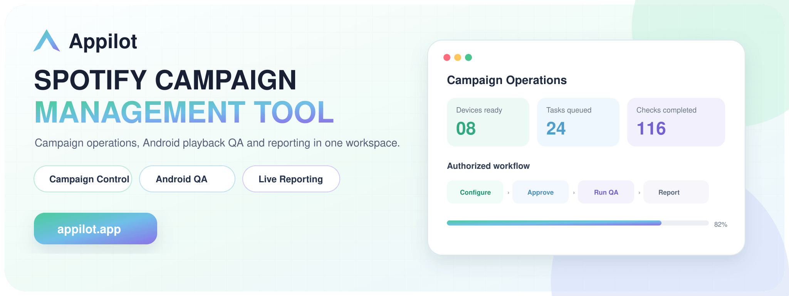
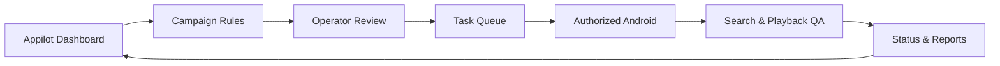
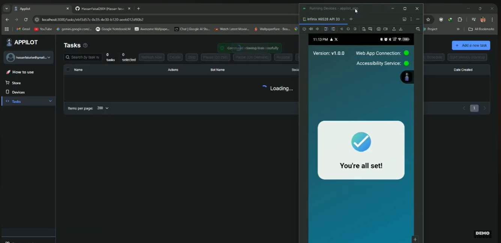
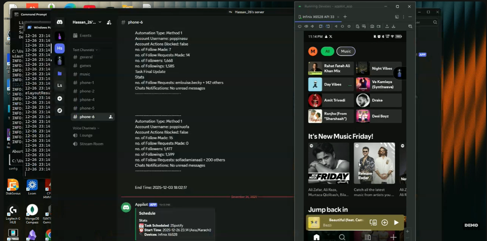
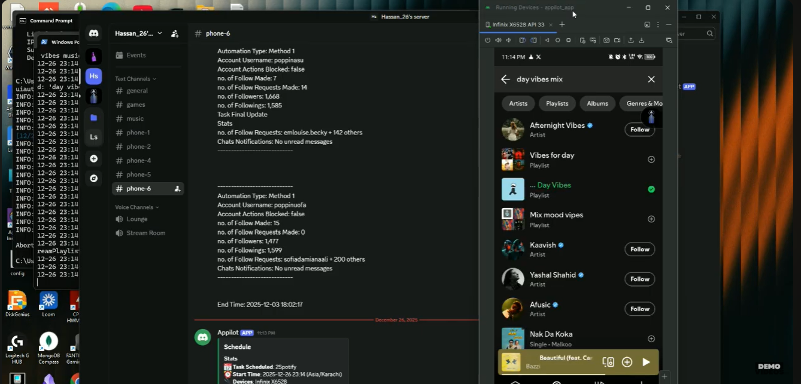
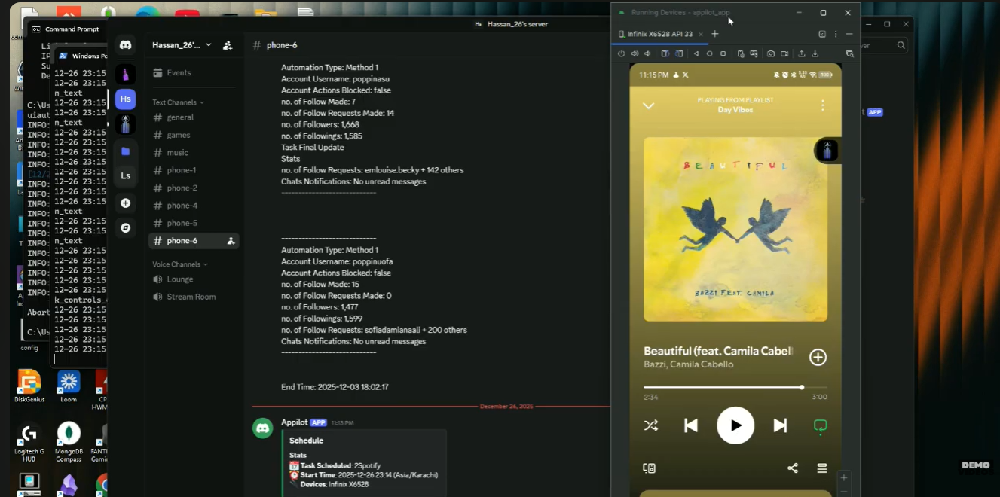
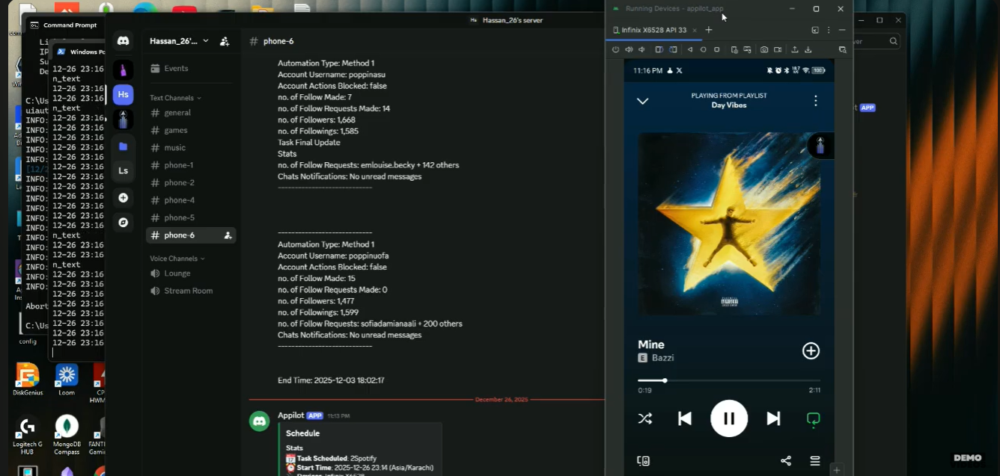

# Spotify Streamer Bot  by Appilot

**A product showcase for centrally coordinating authorized music-marketing campaigns, Android test devices, schedules and operational reporting.**

[](https://www.appilot.app/) [](https://www.youtube.com/watch?v=eCddRbthBq4)

## Demo Video

[](https://www.youtube.com/watch?v=eCddRbthBq4)

**Watch on YouTube:** https://www.youtube.com/watch?v=eCddRbthBq4

## Overview

The Spotify Campaign Management Tool is an Appilot operations layer for organizing authorized music-marketing and playback-testing workflows across real Android devices. Teams can define targets, schedule daily tasks, monitor device readiness and review campaign activity from one dashboard.

This public repository documents the interface and operating model. It does not provide production execution code, account credentials, device sessions or functionality intended to fabricate listening activity.

## Core Capabilities

| Capability | What it provides |
|---|---|
| **Campaign workspace** | Organizes approved artists, releases, albums, songs and playlists. |
| **Task scheduling** | Assigns defined test or campaign tasks to authorized devices. |
| **Real-device visibility** | Displays Android connection and application readiness from one interface. |
| **Account configuration** | Maintains separate settings for authorized test or campaign accounts. |
| **Search-path validation** | Confirms that intended artists, releases and playlists can be located. |
| **Playback QA** | Tests playback flows and application behavior without claiming promotional results. |
| **Operational reporting** | Records task states, exceptions and completion results for review. |
| **Custom deployment** | Adapts dashboard fields, integrations and approval steps to the client workflow. |

## Architecture



## Example Workflow

1. Add approved campaign targets and authorized test accounts.
2. Configure task windows, device assignments and operating limits.
3. Review the campaign plan before tasks enter the queue.
4. Confirm Android device and application readiness.
5. Validate search, navigation and playback paths in the Spotify application.
6. Record completion states and send exceptions for operator review.
7. Use the resulting operational data to improve the campaign workflow.

## Screenshots

<p align="center"><br><b>Appilot task dashboard connected to an authorized Android device</b></p>

<table align="center">
  <tr>
    <td align="center" width="50%"><br><br><b>Spotify home and discovery navigation</b></td>
    <td align="center" width="50%"><br><br><b>Target artist and playlist search validation</b></td>
  </tr>
  <tr>
    <td align="center" width="50%"><br><br><b>Playback-flow quality check</b></td>
    <td align="center" width="50%"><br><br><b>Alternate track playback test</b></td>
  </tr>
</table>

## Use Cases

- Music-marketing teams coordinating campaign tasks and reporting.
- Labels managing release-related operational checklists.
- QA teams validating Spotify mobile search and playback journeys.
- Agencies monitoring authorized Android devices from one workspace.
- Product teams that need a customized approval and reporting layer.

## Repository Contents

```text
spotify-campaign-management-tool/
├── README.md
├── ARCHITECTURE.md
├── DEMO.md
├── REPOSITORY-SETUP.md
├── RESPONSIBLE-USE.md
├── repo-metadata.json
├── LICENSE
├── .gitignore
└── assets/
    ├── banner.png
    ├── banner.svg
    └── screenshots/
        ├── 01-appilot-task-dashboard.png
        ├── 02-spotify-home-navigation.png
        ├── 03-target-search-validation.png
        ├── 04-playback-quality-check.png
        └── 05-alternate-track-test.png
```

## Need a Custom Music Campaign Operations System?

Appilot can design the dashboard, task logic, Android workflow, approvals and reporting around your authorized use case.

**[Discuss Your Project With Appilot](https://www.appilot.app/contact)**

[Visit Appilot](https://www.appilot.app/) · [Watch the Demo](https://www.youtube.com/watch?v=eCddRbthBq4)

